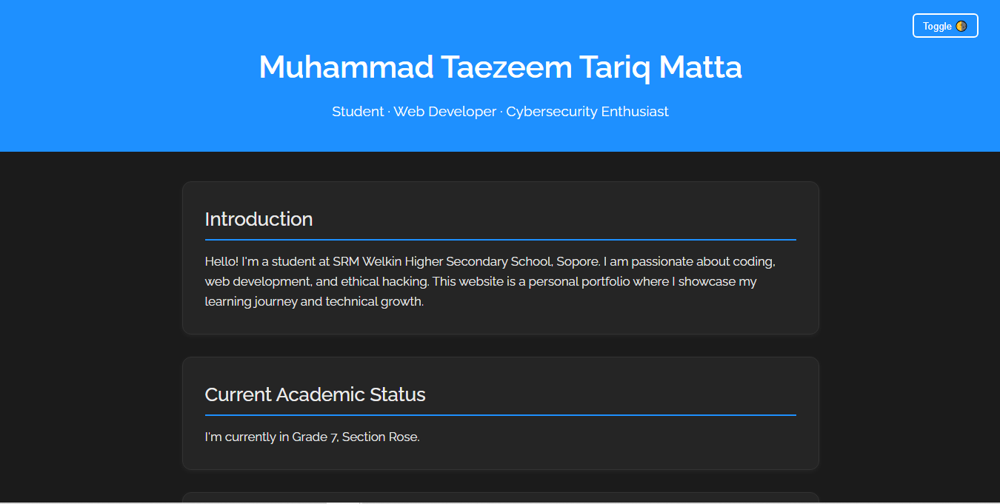

# Me – Personal Portfolio Website

Welcome to **Me**, the personal portfolio of Muhammad Taezeem Tariq Matta — a student, web developer, and cybersecurity enthusiast from Sopore.

This site showcases my technical journey, web development skills, and passion for cybersecurity through a sleek, responsive, and modern design.

---

## 🌐 Live Preview

> Hosted at:  
**https://taezeem14.github.io/About_Me**

---

## ✨ Features

- 🌗 Light/Dark theme toggle
- 📱 Fully responsive layout
- 🧠 Auto-updating academic grade logic
- 🎨 Raleway Google Font
- 💻 HTML, CSS, and JavaScript only (no frameworks)

---

## 🚀 How to Use

1. **Clone the repo**
   ```bash
   git clone https://github.com/taezeem14/About_Me.git
   ```

2. **Open in your browser**  
   Double-click `index.html` or drag it into a browser window.

3. **Customize the content**  
   Edit `index.html` in any text editor to update sections, skills, or style.

---

## 📸 Preview



---

## 👤 Author

**Muhammad Taezeem Tariq Matta**  
Student at SRM Welkin Higher Secondary School, Sopore  
Web Developer • Cybersecurity Enthusiast  
🇮🇳 India

---

## 📜 License

This project is licensed under the **MIT License**.  
You are free to use, modify, and share it for educational and personal purposes.

---
